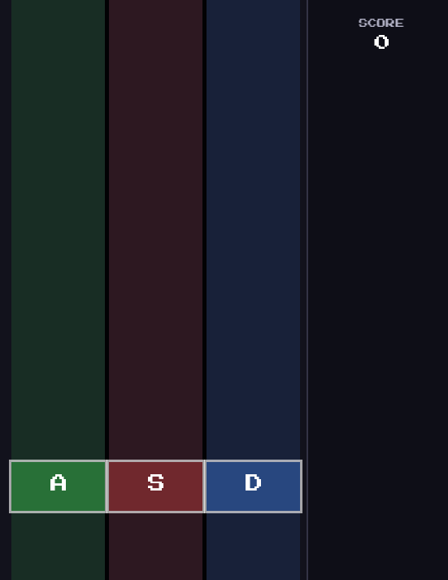

# Guitar Hra

A simple rhythm game built with C++ and SFML. Blocks fall down three lanes — hit the right key when they reach the target zone.



## Controls

| Key | Action |
|-----|--------|
| `A` | Left lane (green) |
| `S` | Middle lane (red) |
| `D` | Right lane (blue) |
| `F11` | Toggle fullscreen |
| `Escape` | Exit fullscreen / close |
| `R` | Restart after game over |

## Features

- 3 color-coded lanes with hit detection window
- Combo multiplier and floating score popups
- Pixel-art hearts with bounce animation on life loss
- Speed increases over time (capped so it stays playable)
- Procedurally generated sounds — no external audio files needed
- Fullscreen support with proper aspect ratio scaling (letterbox)
- Press any key → 3-second countdown → game starts

## Building

**Requirements:** Visual Studio 2022, [SFML 2.6.1](https://www.sfml-dev.org/download/sfml/2.6.1/) (VC++17 64-bit)

1. Clone the repo
2. Place the SFML `include/` and `lib/` folders under `C:\SFML\`
3. Copy the SFML `.dll` files into the project folder
4. Open `GuitarHra.sln` in Visual Studio
5. Set configuration to **Debug x64** and hit `Ctrl+F5`

**Linker dependencies (Debug):**
```
sfml-graphics-d.lib
sfml-window-d.lib
sfml-system-d.lib
sfml-audio-d.lib
```

**Optional font:** Download [Press Start 2P](https://fonts.google.com/specimen/Press+Start+2P) and place `PressStart2P-Regular.ttf` in the project folder. Falls back to Arial if not found.

## Project structure

```
├── main (GuitarHra.cpp)   window, game loop, fullscreen toggle
├── Game.h / Game.cpp      game logic, rendering, input
├── Block.h                block data struct
├── Constants.h            all tunable values in one place
├── Utils.h                view scaling, color helpers
└── HeartTexture.h/.cpp    procedural pixel-art heart texture
```
